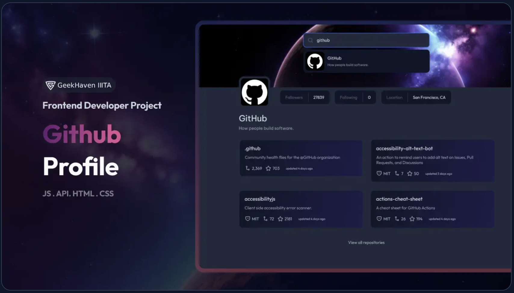
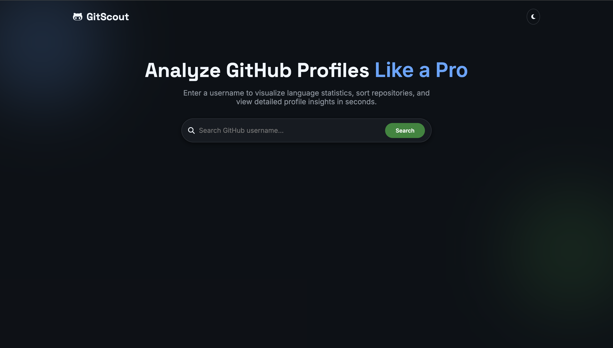
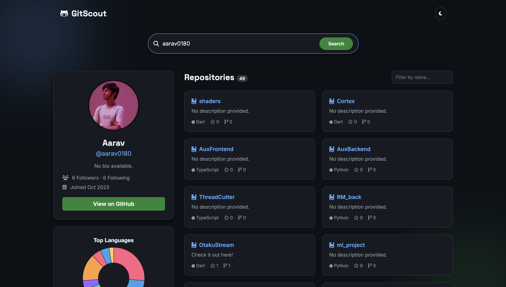
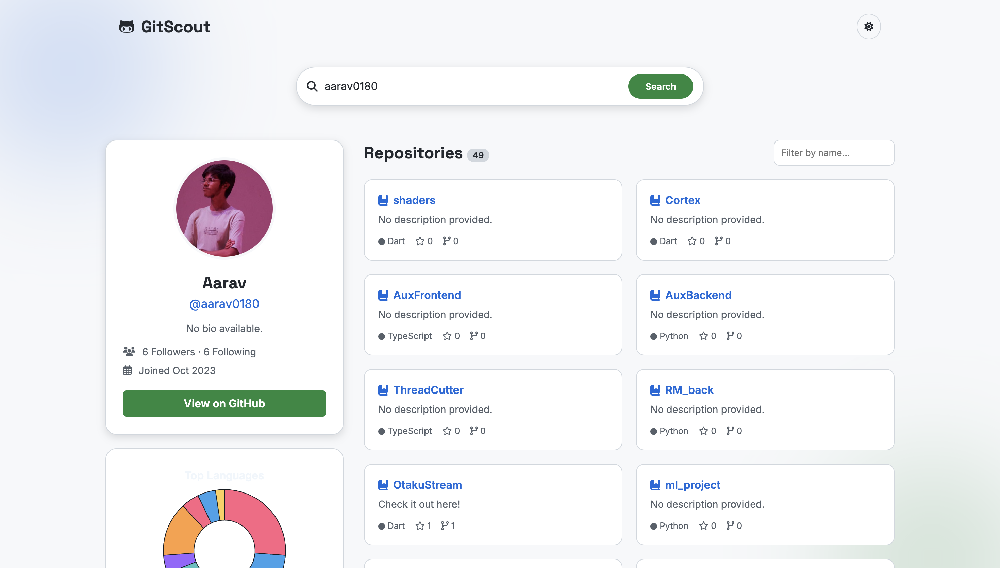

# CSS Battle – GitScout (GitHub Profile Search App)

This project is my submission for the **OpenCode CSS Battle Challenge**.  
The goal was to recreate a GitHub Profile UI using pure frontend skills with a clean, responsive and pixel-perfect implementation.

## 🚀 Live Demo
https://gitscout007.netlify.app/

## 📂 GitHub Repository
https://github.com/CoderMS07/GitScout-

---

## 🎯 Challenge Description

Recreate a GitHub Profile search application UI that allows users to:

- Search any GitHub username  
- View profile details (followers, following, location)  
- View repositories  
- Open repository page in a new tab  
- Experience a responsive, modern UI  

---

## 🛠 Tech Stack

- HTML  
- CSS  
- JavaScript  
- GitHub REST API  

---

## 📸 Screenshots

### Original Design


### My Implementation




---

## ⚙️ Features

- GitHub username search  
- Profile avatar & details  
- Followers, Following, Location  
- Repository listing with details  
- Clickable repo cards  
- Fully responsive layout  

---

## 📋 How to Run Locally

```bash
git clone https://github.com/CoderMS07/GitScout.git
cd GitScout
open index.html
